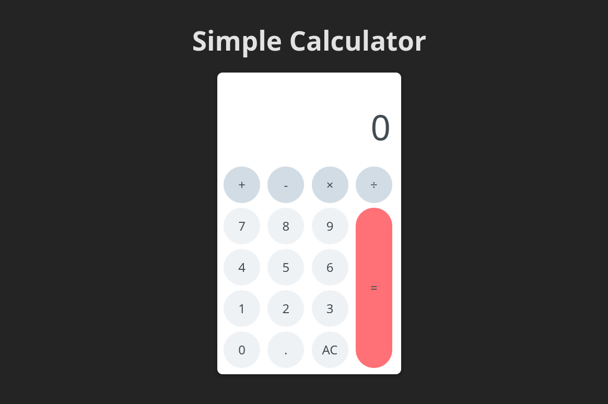

<strong><h1 align="center">Simple Calculator</h1></strong>
<p align="center"><strong>Project developed for a technical challenge/test</strong></p>

<p align="center">
  
</p>

## 🚀 Challenge
Create a calculator that takes two numbers and an operator (+, -, *, /) and returns the result
of the operation.

## 🛰️ Technologies
This project was developed with the following technologies:

- React
- Typescript
## 💻 Installation / How to use
- Clone this repository:
   ```bash
   git clone https://github.com/jairokoning/simple-calculator.git
   ```
- Install dependencies:
   ```bash
   npm i
   ```
- Start the application
   ```bash
   npm run dev
   ```
---

_Developed with_ 😀 _and_ ♥ _by [Jairo Koning](https://linkedin/in/jairokoning)_